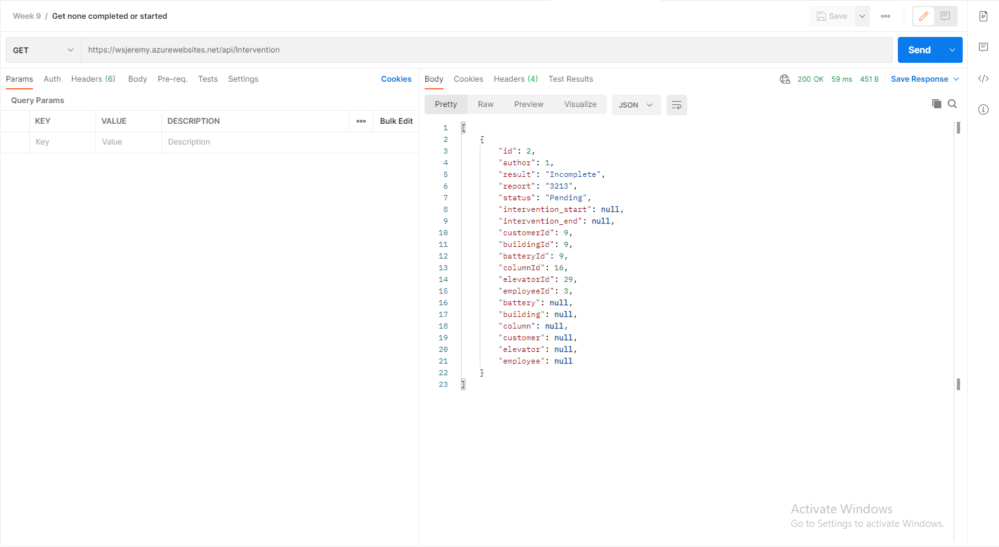
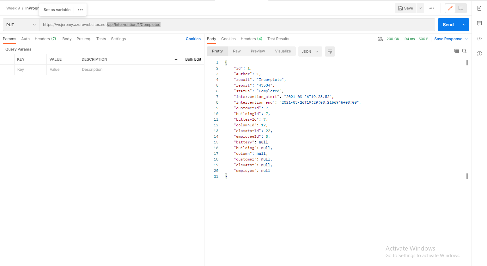

# Rocket-Elevator-Foundation-REST

# GET None Completed or Started
/api/Intervention/

Show all intervention without a start date and are pending

# GET None Completed or Started
/api/Intervention/{id}/{status}

Change intervention to desired {status} and timestamp it

